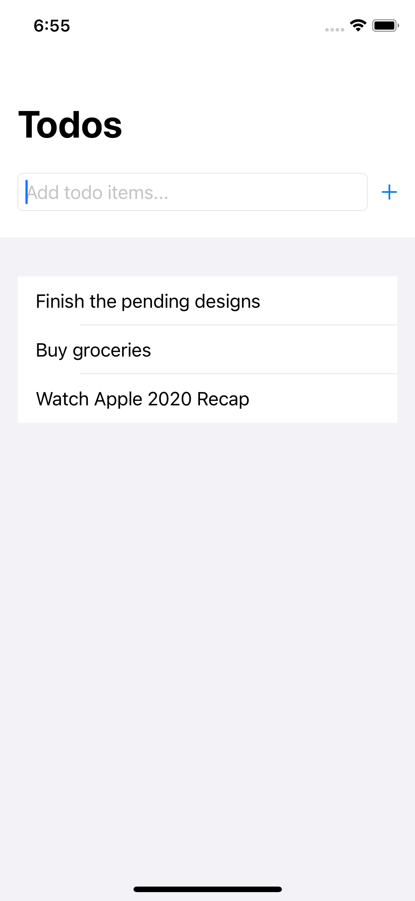
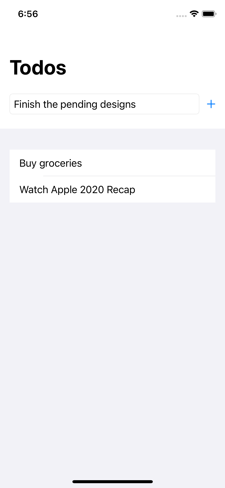
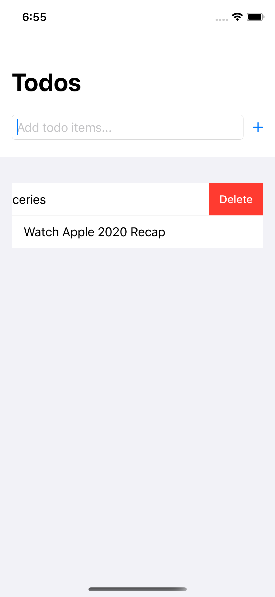

# iOS-TodoApp
A Simple todo app made using SwiftUI framework. Used userDefaults to restore todo items after app is killed

## Screenshots
<table>
   <tr>
      <td></td>
      <td></td>
      <td></td>
  </tr>
</table>
